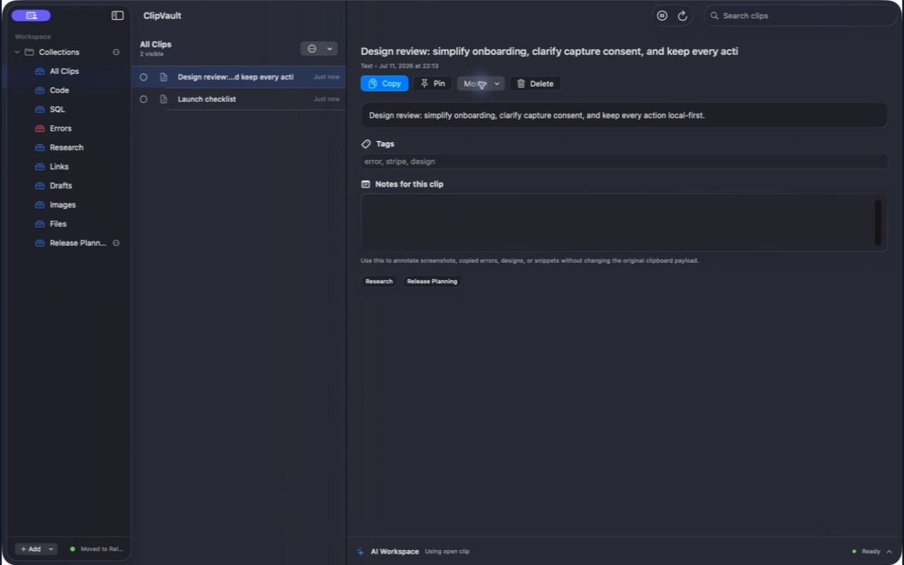

# ClipVault

ClipVault is a local-first clipboard workspace for macOS. It captures clipboard items only after consent, filters sensitive-looking values before storage, encrypts clip payloads and details locally, and keeps retrieval fast from the menu bar or the main workspace.



## Project status

ClipVault is a pre-1.0 release candidate maintained by [RSI Tech](https://rsitech.ai). The source, tests, and local app bundle are actively hardened, but no public binary release has been published. The current build targets macOS 15 or later on Apple silicon.

## What it does

- Captures text, code, links, images, screenshots, and file references after an explicit first-run disclosure.
- Excludes obvious private keys, common API tokens, and password-like values before persistence.
- Encrypts clipboard payloads and user-authored clip details with AES-GCM using a device-bound Keychain key.
- Searches clip content, OCR text, notes, and tags using a bundled Rust search core.
- Supports pinning, duplicate grouping, retention rules, folders, and custom collections.
- Copies a selected clip back to the pasteboard from the workspace or menu bar.
- Offers on-device prompt enhancement through Apple Foundation Models when the model is available.

ClipVault does not provide cloud sync, accounts, team workspaces, or a cloud AI fallback. Foundation Models actions explain their unavailable state instead of sending content elsewhere.

## Requirements

- Apple-silicon Mac running macOS 15 or later
- Xcode 26 or later with macOS command-line tools
- Swift 6
- Rust 1.85 or later, including Cargo
- ripgrep 15 or later for the shell policy tests

The Swift target links a locally built Rust library. A bare `swift build` or `swift test` from a fresh clone will fail until the Rust release library exists. Use the repository scripts below; they build Rust first.

## Build and run

```bash
git clone https://github.com/rsitech-ai/clip_vault.git
cd clip_vault
./script/build_and_run.sh --verify
```

The script builds the Rust core and Swift app, stages `dist/ClipVault.app`, signs it with a local Apple Development identity when available (otherwise ad hoc), launches it, and verifies that the exact staged executable remains alive.

On first launch, ClipVault asks for clipboard-capture consent. Capture remains off until that disclosure is accepted and can be paused or revoked in Settings.

## Test

Run the complete local test lane:

```bash
./script/test.sh
```

It runs shell policy tests, Rust tests, builds the Rust release library, and then runs the Swift test suites.

Useful focused checks:

```bash
cargo fmt --manifest-path rust/SearchIndexCore/Cargo.toml --check
cargo clippy --manifest-path rust/SearchIndexCore/Cargo.toml --all-targets --all-features -- -D warnings
cargo audit --file rust/SearchIndexCore/Cargo.lock
swift build -c release -Xswiftc -warnings-as-errors
git diff --check
```

`cargo audit` is optional locally unless `cargo-audit` is installed; CI installs a pinned version.

### End-to-end smoke

```bash
./script/e2e_smoke.sh
```

The smoke test builds and launches a per-run non-production bundle, writes an isolated test token to a private pasteboard, and verifies capture, deduplication, persistence, and restart recovery. It creates temporary sandbox and Keychain state under a validated E2E namespace, removes its data at exit, and never uses the production bundle identifier.

## Privacy and security boundaries

Clipboard data stays on the Mac. ClipVault does not send clipboard contents to the developer or third parties, and the current build has no enabled cloud AI provider. Operational metadata needed for indexing and deduplication remains in the sandboxed local database; the exact boundary is documented in [PRIVACY.md](PRIVACY.md).

Sensitive-value detection is a safety net, not a password manager guarantee. Do not copy secrets solely because ClipVault attempts to exclude common credential formats.

See [SECURITY.md](SECURITY.md) for the vulnerability-reporting policy and [SUPPORT.md](SUPPORT.md) for normal support requests.

## Architecture

ClipVault is a SwiftPM application with three main boundaries:

- `Sources/ClipVault`: macOS scenes, menu-bar and workspace UI, and application orchestration.
- `Sources/ClipVaultCore`: persistence, capture consent, encryption, pasteboard integration, search bridging, and model-provider boundaries.
- `rust/SearchIndexCore`: deterministic normalization, fingerprints, lexical search, and FFI exports.

See [docs/ARCHITECTURE.md](docs/ARCHITECTURE.md) for the data flow and trust boundaries.

## Development and releases

- [CONTRIBUTING.md](CONTRIBUTING.md) explains setup, test expectations, and pull-request scope.
- [CODE_OF_CONDUCT.md](CODE_OF_CONDUCT.md) defines the community standard and enforcement route.
- [CHANGELOG.md](CHANGELOG.md) records user-visible changes.
- [docs/RELEASING.md](docs/RELEASING.md) separates source, direct-download, and Mac App Store release gates.
- [docs/release/0.1.0/RELEASE_STATUS.md](docs/release/0.1.0/RELEASE_STATUS.md) records the current evidence and blockers for the first release.

## License

Copyright © 2026 Rafal Sikora. ClipVault is licensed under the [Apache License 2.0](LICENSE). See [NOTICE](NOTICE) for attribution. RSI Tech is the public project maintainer; contact [info@rsitech.ai](mailto:info@rsitech.ai).
