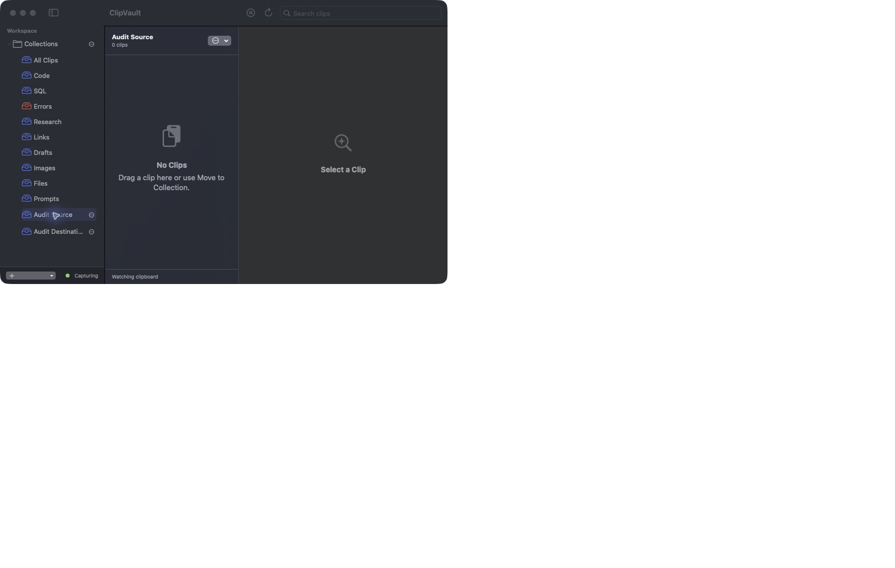

# Workspace reliability verification — 7 October 2026

This audit traced native capture, encrypted persistence, collection membership,
search projection, selection, metadata editing, cleanup, AI actions, and packaging.
Baseline: `31fe2f181148df798acda0ad0115ff3cacf2730e`. Live checks used a signed
release app with a disposable bundle identifier, store, Keychain key and private
pasteboard on macOS 27, arm64, Swift 6.4 and Rust 1.97.1. Personal clips were
excluded from fixtures and public evidence.

## Findings and corrections

- The sidebar assignment command added a second manual membership. It now uses
  the same move operation as the detail menu: replace manual memberships, retain
  automatic smart memberships, and reconcile the visible list and selection.
- Same-OCR images and rich text could overwrite different binary payloads.
  Candidates now use a binary digest and require exact payload comparison before
  duplicate refresh. Legacy fingerprints remain discoverable and safely rekey
  only when the payload matches. Text identity remains compatible.
- Ordinary persistence mutations lacked the folder-operation rollback fence.
  Capture, pin, metadata, and deletion now discard pending changes on save failure.
  Batch deletion commits once. Reading already-encrypted records no longer sets
  empty legacy fields and causes redundant saves.
- Blank titles and unavailable stores could produce misleading UI state.
  Input and store availability are checked before mutation. Storage startup
  failure stops capture rather than presenting an ephemeral fallback as saved.
- Collection changes repeatedly ranked the same global search data. The cached
  global ranking is filtered for a collection; query, source and expiry changes
  still invalidate it. List and global menu results retain their ordering.
- Operation status is visible in the list footer. Empty collection/search states
  and sidebar hints explain manual moves and automatic smart membership.
- Window confirmation now hit-tests the click location. A failed full-page frame
  aborts rather than returning a successful partial capture. User cancellation
  is handled without logging an error.
- Local AI source counts now describe the inputs actually used by each action.
  The UI calls these source clips; it does not claim verified citations.

No persistent schema changes, cloud AI enablement, permission expansion or Rust
FFI changes were introduced.

## Regression and integration evidence

Failing regressions were observed before repairs for sidebar movement, unavailable
storage and blank titles, binary deduplication, mutation rollback, and AI source
counts. The final Swift run passed 221 core tests in 25 suites and four app tests
in one suite. Rust passed four unit tests; shell integration tests passed.

Required local checks:

| Command | Observed result |
|---|---|
| `./script/test.sh` | Passed shell, Rust and full Swift tests |
| `cargo fmt --manifest-path rust/SearchIndexCore/Cargo.toml --check` | Passed |
| `cargo clippy --manifest-path rust/SearchIndexCore/Cargo.toml --all-targets --all-features -- -D warnings` | Passed without warnings |
| `cargo audit --file rust/SearchIndexCore/Cargo.lock` | No vulnerable dependencies reported |
| `cargo deny --manifest-path rust/SearchIndexCore/Cargo.toml check` | Advisories, bans, licenses and sources passed |
| `swift build -c release -Xswiftc -warnings-as-errors` | Passed |
| `./script/e2e_smoke.sh` | Signed app-owned probe verified capture, duplicate count, persistence and restart |
| `./script/build_and_run.sh --verify` | Signed release app launched and remained alive |
| `git diff --check` | Passed |

Additional tests cover forced fingerprint collisions, distinct images/RTF with
identical searchable text, exact repeats, legacy candidate mismatches, save
failure rollback, atomic batch deletion, selection reconciliation, title
validation, store absence, source-count accuracy and search cache invalidation.

## Native workflow evidence

- Created source and destination collections. Detail-menu movement and sidebar
  movement left only the destination manual membership. Smart Research membership
  remained, as intended.
- Selected two clips and moved them through the sidebar. The source became empty,
  the detail cleared, the destination contained both clips, and batch selection
  reset. The visible footer reported the operation.
- Saved title, pin, tags and note. Search found the saved note; a nonmatching query
  showed No Matches and cleared the detail. Clearing search restored the clip.
- Focus/restore worked at the minimum workspace size. Rows kept their title and
  snippet on separate full-width lines, with time in metadata.
- Inspected General, Capture, Access, AI, Surfaces and About. Cloud AI remained
  disabled. Foundation Models reported availability and completed a summary and
  prompt generation. Open Prompts navigated to the generated clip.
- A signed probe confirmed the original synthetic clip persisted with one row
  and one copy. Relaunch verified saved memberships and metadata.

## Performance measurement

The release projection workload used 2,000 synthetic clips and 100 collection
switches: 0.218747208 seconds before and 0.018533292 seconds after (about 11.8×
faster in this bounded workload). This measures projection switching, not total
application latency. A counting regression proves that unchanged collection
switches reuse one ranking pass; changed input/query forces a new ranking.

## Universal Clipboard compatibility

Apple documents that `NSPasteboard.general` automatically participates in
Universal Clipboard and exposes no separate macOS handoff API. ClipVault's
production capture and copy services use that general pasteboard. Capture reads
content without clearing, rewriting or setting device-local contents options.
Copy writes standard text, URL, rich-text, image or file representations and
does not replay stored origin/privacy marker types or set `currentHostOnly`.
Consuming a self-generated change updates only the monitor's local counter.
Pausing capture does not clear the system clipboard.

Additional named-pasteboard tests verify exact Unicode text capture without any
change to clipboard data, types or change count; stopping/consuming remains
read-only. A rich-text copy test verifies exact RTF and plain text, dropping
unrelated source markers. These are local integration checks, not a physical
Handoff simulation. Remote marker strings in fixtures are compatibility data,
not a dependency on an undocumented transfer API.

The receiving iPhone/Mac does not require ClipVault for Apple's ordinary
copy/paste. Devices need Apple's supported configuration: nearby, same Apple
Account, Wi-Fi, Bluetooth and Handoff enabled. ClipVault history and collections
remain local to each Mac; this change does not add history synchronization.
Physical iPhone-to-Mac and Mac-to-Mac checks are PENDING and will be recorded
separately from the local integration tests.

## Review and limits

A fresh independent, read-only reviewer examined the final source/test patch,
including mutation rollback, duplicate payload identity, selection flow, cache
invalidation and capture error paths. No reproducible merge blocker was found.
Hosted CI must pass on the exact PR head before merge.

Native drag gestures, all display/appearance combinations, permission dialogs,
browser Automation and induced mid-scroll capture failures are not fully proven
by the native checks above. Their supporting source and tests do not constitute
live proof. Full-page capture remains scroll-and-stitch with existing frame and
canvas limits; sticky elements, lazy loading and browser behavior can affect it.
Foundation Models output remains nondeterministic: an observed enhanced prompt
introduced unsupported examples and references. Generated text needs review;
successful generation is not a factual-accuracy guarantee.

## Official references used

- [SwiftData ModelContext](https://developer.apple.com/documentation/swiftdata/modelcontext): tracked changes, save and rollback semantics.
- [Apple drag-and-drop guidance](https://developer.apple.com/design/human-interface-guidelines/drag-and-drop): move destination behavior and menu alternatives.
- [SwiftUI drag and drop](https://developer.apple.com/documentation/swiftui/drag-and-drop): transfer and destination flow.
- [Apple sidebar guidance](https://developer.apple.com/design/human-interface-guidelines/sidebars): navigation and selection clarity.
- [CryptoKit hashing](https://developer.apple.com/documentation/cryptokit/hashfunction/hash%28data%3A%29): binary payload digests; exact equality remains the duplicate authorization.
- [ScreenCaptureKit](https://developer.apple.com/documentation/screencapturekit): display/window capture boundaries; offscreen pages require scrolling.
- [Rust CString](https://doc.rust-lang.org/stable/std/ffi/c_str/struct.CString.html): existing FFI ownership and termination review.
- [NSPasteboard](https://developer.apple.com/documentation/appkit/nspasteboard): automatic general-pasteboard participation in Universal Clipboard.
- [Current-host-only contents](https://developer.apple.com/documentation/appkit/nspasteboard/contentsoptions/currenthostonly): explicit device-local restriction, which ClipVault does not use.
- [Apple Universal Clipboard setup](https://support.apple.com/en-gb/102430): device requirements and ordinary cross-device copy/paste.
